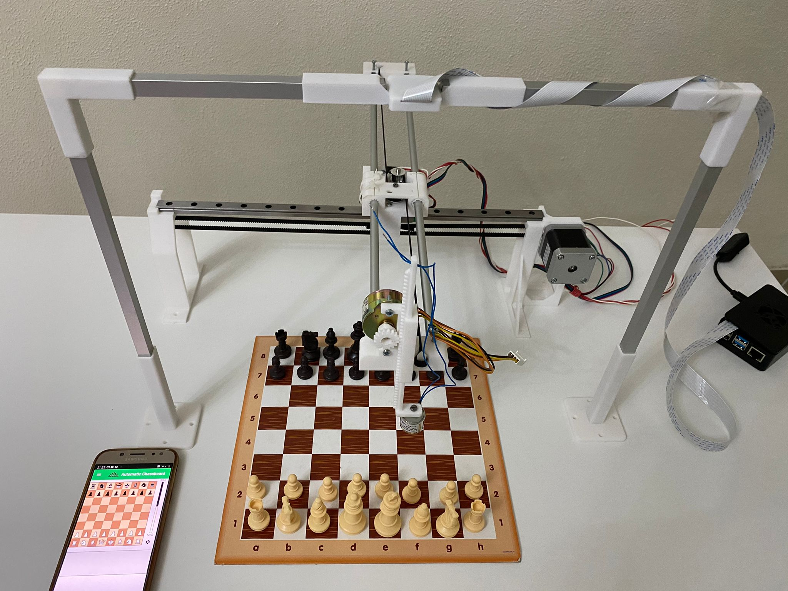

# Automatic-Chessboard

Is a prototype that allows a user to play chess, in its complete way possible, on a physical chessboard in an automatic way

**Game Mode**:
* Against the **Computer** (StockFish).
* **Multiplayer** against a friend, from a distance (distance limited by Bluetooth for now)
* **Chess Problems**
* **Specific Position** determined by the player

The choice of game mode and parameters is controlled by a graphic mobile application via Bluetooth.

The pieces are recognized through a Machine Learning algorithm like this: https://github.com/giuseppemacc/Image-Recognition-PyTorch

* **Work in progress . . .**
