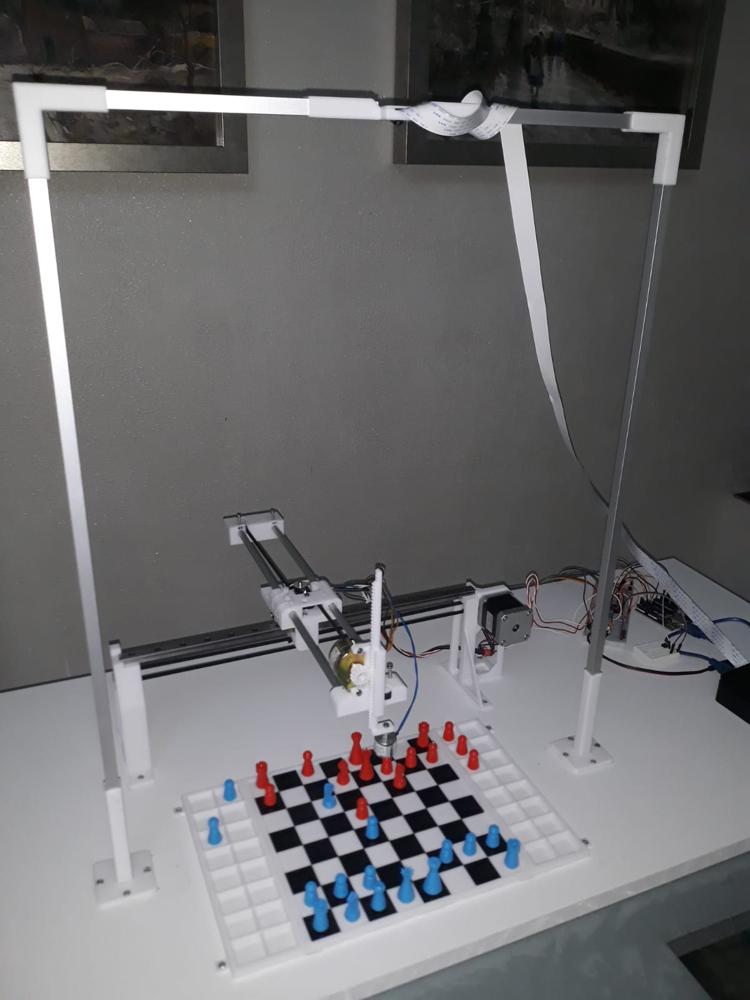

# Automatic-Chessboard

È un sistema il cui obiettivo è quello di avere una scacchiera fisica automatica che permetta di giocare delle partite, o delle particolari posizioni, di scacchi contro un computer

* **Work in progress . . .**
